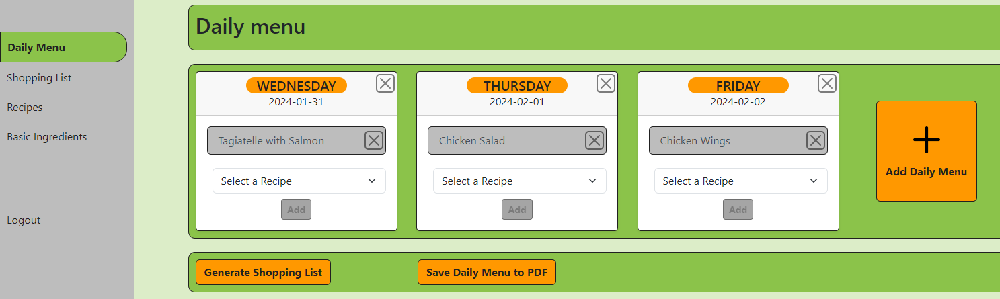
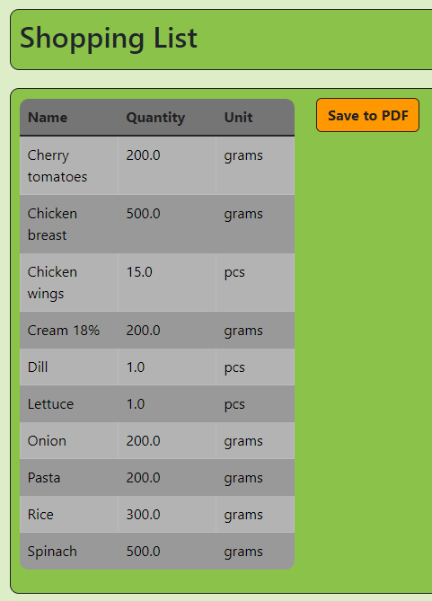
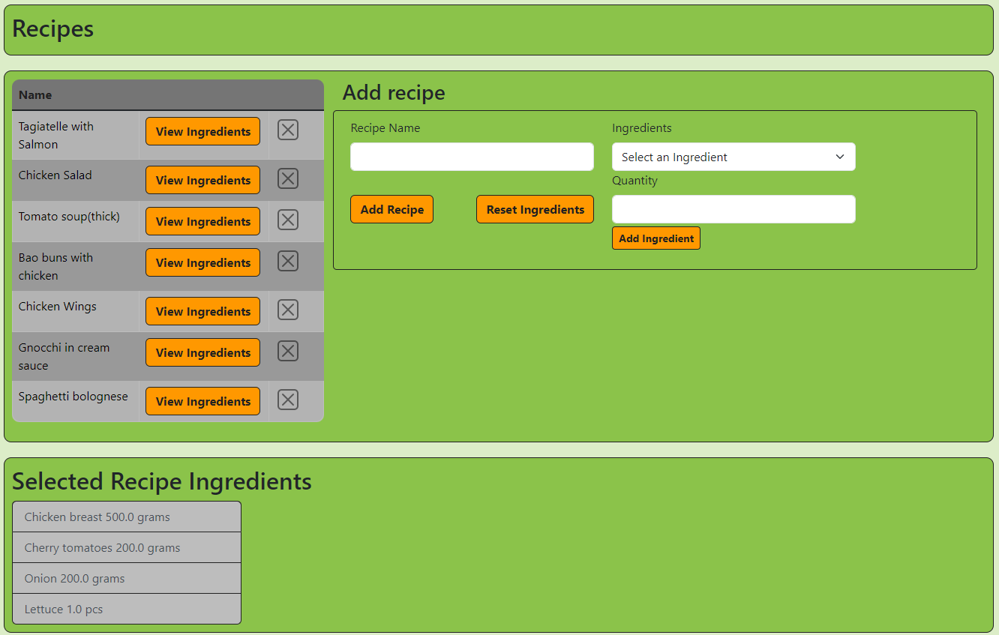

# MealMate

## Meal Planner Application

The Meal Planner application is a Java-based web application built with the Spring Framework. It provides users with the
ability to plan meals for the upcoming week or month and automatically generates a shopping list based on the selected
recipes.

## Features

- **Recipe Management:** Create, edit, and delete recipes.
- **Meal Planning:** Plan meals for the upcoming week or month.
- **Shopping List Generation:** Automatically generate a shopping list based on planned meals.
- **User Authentication:** Secure user authentication and authorization.

## Technologies Used

- **Spring Boot**
- **Thymeleaf**
- **HTML/CSS**
- **H2 Database**
- **JavaScript**
- **OpenPDF** - https://github.com/LibrePDF/OpenPDF

## Prerequisites

- Java Development Kit (JDK) version 17 or Docker
- Integrated Development Environment (IDE) like IntelliJ or Eclipse

## Installation

1. **Clone the repository:**
   ``git clone https://github.com/La-vendor/mealmate.git``
2. Open the project in your preferred IDE.
3. Run the application:
   ``./mvnw spring-boot:run``
4. Access the application at http://localhost:8080/daily-menu

## Docker Option

Alternatively, you can use Docker. Make sure you have Docker and Docker Compose or Docker Desktop installed:

1. **Clone the repository:**
   ``git clone https://github.com/La-vendor/mealmate.git``
2. Open the project in your preferred IDE.
3. Run the application by command:
   ``docker compose up``
4. Access the application at http://localhost:8080/daily-menu

## Usage

1. **Register/Login:**

    - Create a new account or log in if you already have one. - _TO DO_

2. **Ingredients Management:**

    - Navigate to the "Ingredients" tab to manage your ingredients.
    - Add new Ingredients. - _DONE_
    - Add new Ingredients from external API. - _TO DO_

3. **Recipe Management:**

    - Navigate to the "Recipes" tab to manage your recipes.
    - Add new recipes with ingredients. - _DONE_
    - Display ingredients of selected recipe. - _DONE_

4. **Meal Planning:**

    - Go to the "Meal Planner" section to plan your meals for the upcoming week or month.
    - Download Meal Plan in PDF. - _DONE_

5. **Generate Shopping List:**

    - Once meals are planned, you can generate shopping list, that includes aggregated ingredients from all selected
      recipes.
    - Download shopping list in PDF. - _DONE_

# Screenshots

1. **Daily Menu**

   
2. **Shopping List**

3. **Recipes**

4. **Basic Ingredients**

## Options for future

* migrate from H2 to PostgeSQL
* deploy application in cloud service like Railway or Heroku
